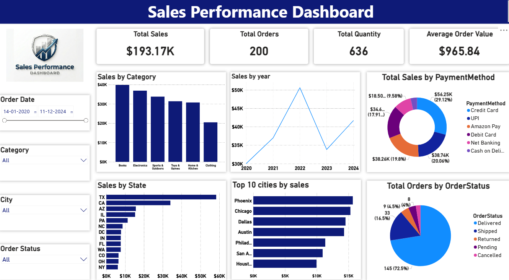

## 📊 Sales Performance Dashboard (Power BI)

### 🔍 Project Overview

Developed an interactive Sales Performance Dashboard using Power BI to analyze business sales data and generate actionable insights. The dashboard tracks key performance indicators (KPIs) such as total sales, order volume, quantity sold, and average order value.

---

### 🛠 Tools & Technologies

* Power BI
* Data Cleaning & Transformation
* Data Modeling
* DAX (Basic Measures)

---

### 📈 Key Insights

* Total Sales reached **$193K+** with **200 orders** and **636 items sold**
* Highest sales observed in **2022**, indicating peak business performance
* **Books and Electronics** categories generated the most revenue
* **Texas (TX)** recorded the highest sales among all states
* Majority of orders were successfully **delivered (72%+)**
* **Credit Card and UPI** were the most preferred payment methods

---

### 📊 Dashboard Features

* KPI cards displaying Total Sales, Orders, Quantity, and Average Order Value
* Sales analysis by **Category, Year, State, and Top Cities**
* Interactive slicers for filtering by **Date, Category, City, and Order Status**
* Visual breakdown of **Payment Methods and Order Status**
* Clean and user-friendly layout for quick decision-making

---

### 🎯 Skills Demonstrated

* Data Visualization
* Business Data Analysis
* Dashboard Design
* Insight Generation
* Problem Solving

---

### 📷 Dashboard Preview

---

### 🎥 Demo Video
[Click here to watch the demo](./pbi-project-1.mp4)
